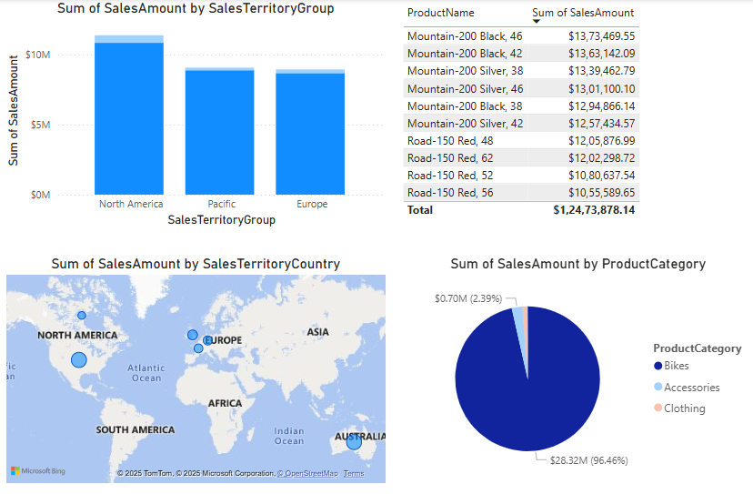

# AdventureWorks Sales Analytics Power BI Project

Welcome to the **AdventureWorks Sales Analytics** project!  
This repository contains all the resources, instructions, and visuals for building a Power BI report using AdventureWorks sales data sourced from Excel. The report is designed to help business analysts create insightful dashboards in the Power BI service.

---

## **Project Overview**

This project demonstrates how to:
- Prepare and format Excel data for optimal Power BI performance
- Import, transform, and visualize AdventureWorks sales data
- Build interactive reports and dashboards for sales analysis

---

## **Key Features**

- **Data Preparation:**  
  - Excel file size optimization  
  - Standardized cell styles and table formatting

- **Power BI Data Modeling:**  
  - Date and currency type conversions  
  - Clean data loading and transformation

- **Visualizations:**  
  - SalesAmount by SalesTerritoryGroup (column chart)
  - SalesAmount by SalesTerritoryCountry (map visual)
  - Top 10 products by SalesAmount (bar/table visual)
  - Product distribution by category (pie chart)

---

## **Setup Instructions**

### **1. Excel Data Preparation**
- Remove unnecessary data, images, and formatting to reduce file size.
- Change all cell styles to "Normal."
- Convert raw data into an Excel Table (Insert > Table).

### **2. Import Data into Power BI Desktop**
- Open Power BI Desktop.
- Go to **Home > Get Data > Excel** and select the Adventure Sales Excel file.
- Load the relevant tables (e.g., Sales).

### **3. Data Transformation in Power BI**
- Convert `OrderDate`, `DueDate`, and `ShipDate` columns to **Date** type.
- Set `StandardCost`, `SalesAmount`, and `TaxAmt` columns to **Currency** (US Dollar).

### **4. Build Visuals**
- **Column Chart:** SalesAmount vs SalesTerritoryGroup
- **Map Visual:** SalesTerritoryCountry and SalesAmount
- **Top 10 Products:**  
  - Add a table or bar chart visual.
  - Drag Product and SalesAmount fields.
  - In the Filters pane, set "Top N" filter to 10 by SalesAmount.
  - Sort the visual in descending order by SalesAmount.
- **Pie Chart:** Product distribution by category

---

## **Screenshots**

> _Add screenshots of your Power BI report here for visual reference._  
>  
> 

1. Clone or download this repository.
2. Follow the setup instructions above.
3. Open the Power BI Desktop file (`.pbix`) and connect to your Excel data if prompted.
4. Explore and customize the report as needed.

---

## **About**

Author: [RahulRmCoder](https://github.com/RahulRmCoder)  
Project Date: April 2025

---

## **License**

This project is open source and available under the [MIT License](LICENSE).
